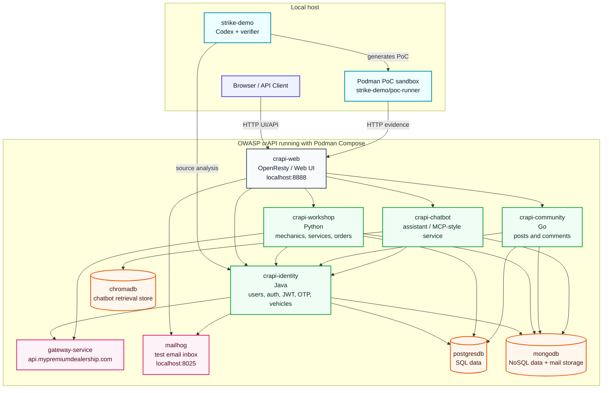

# Strike Demo

Vulnerability auto-verification demo for OWASP crAPI.

The demo shows a 5-10 minute flow where Codex detects candidate API
vulnerabilities, generates an executable proof of concept for each finding,
runs that PoC in an isolated Podman sandbox, and returns a structured verdict:

- `CONFIRMED`: executable evidence supports the hypothesis.
- `FAILED`: the PoC ran and did not support the hypothesis.
- `UNCLEAR`: the system could not prove the finding and should escalate it to a
  human reviewer.

The intended message is narrow: this does not replace human security reviewers.
It removes mechanical verification work when a finding can be safely reproduced.

## Target Application: OWASP crAPI

The application under test is OWASP crAPI, the "completely ridiculous API".
It is an intentionally vulnerable B2C car-service platform built for API
security training. A user can create an account, log in, register vehicles,
request mechanic services, buy car accessories, and interact with a community
blog/comments area.

For this demo, crAPI is useful because it looks like a realistic API-backed
product while deliberately exposing OWASP API Top 10 weaknesses. The demo agent
does not need to attack a real third-party system: it can analyze and verify
findings against this authorized local target.

### crAPI Architecture



In the live demo, the bounded scope is `services/identity`. That keeps the run
short and focuses Codex on authentication, authorization, JWT/OTP, account, and
vehicle-management code paths.

## Repository Layout

```text
strike-demo/
├── AGENTS.md
├── PLAN.md
├── README.md
├── docker/
│   └── poc-runner/
│       └── Dockerfile
├── findings/
│   ├── cache/
│   │   └── identity-candidates.json
│   └── *.json
├── scripts/
│   ├── 01_detect.py
│   ├── 02_verify.py
│   ├── 03_demo.py
│   ├── common.py
│   ├── models.py
│   └── sandbox_mcp.py
├── pyproject.toml
└── uv.lock
```

## Requirements

- Python 3.12
- `uv`
- Codex CLI authenticated with a model that can inspect the crAPI source tree
- Podman
- `podman compose` or `podman-compose`

This project is configured for Podman by default. The scripts accept
`--runtime podman` explicitly when needed.

## Install Dependencies

```bash
uv sync
```

If your environment has a read-only global uv cache, use a writable cache:

```bash
UV_CACHE_DIR=/tmp/uv-cache uv sync
```

## Rehearsal Mode

Use rehearsal mode when you want a deterministic demo without depending on
Codex, crAPI, network state, or the Podman runner.

```bash
UV_CACHE_DIR=/tmp/uv-cache uv run python scripts/03_demo.py --from-cache --no-pause
```

Expected result:

```text
Metrics: 2 confirmed, 1 unclear, 0 failed.
```

For a live presentation, omit `--no-pause` so the script pauses between steps:

```bash
UV_CACHE_DIR=/tmp/uv-cache uv run python scripts/03_demo.py --from-cache
```

## Live Setup With crAPI

Clone crAPI into the repository root:

```bash
git clone https://github.com/OWASP/crAPI.git
```

Start crAPI with Podman Compose:

```bash
cd crAPI/deploy/docker
podman compose -f docker-compose.yml up -d
```

If your environment uses the standalone compose wrapper:

```bash
cd crAPI/deploy/docker
podman-compose -f docker-compose.yml up -d
```

Verify the target is reachable:

```bash
curl -i http://localhost:8888
```

The scripts use `http://localhost:8888` by default. Override it with
`--target-url` if needed.

## Build the PoC Runner

From the repository root:

```bash
podman build -t strike-demo/poc-runner:latest docker/poc-runner
```

The runner image contains Python, `httpx`, `requests`, `curl`, and `jq`. PoCs are
mounted read-only into the container and executed with:

- read-only filesystem,
- memory limit,
- PID limit,
- automatic cleanup,
- target URL passed through `TARGET_URL`.

## Live Detection

Run the detector against `services/identity`:

```bash
UV_CACHE_DIR=/tmp/uv-cache uv run python scripts/01_detect.py --service identity
```

This writes:

- `findings/candidates-<timestamp>.json`
- `findings/candidates-latest.json`

The detector calls:

```bash
codex exec --model gpt-5.5 --json --cwd ./crAPI "<detection prompt>"
```

The expected output schema is validated with Pydantic before it is written.

## Live Verification

Verify the latest candidates. In live mode, this step calls Codex again to
generate a finding-specific Python PoC, then executes that PoC through the
Podman sandbox:

```bash
UV_CACHE_DIR=/tmp/uv-cache uv run python scripts/02_verify.py \
  --input findings/candidates-latest.json \
  --target-url http://localhost:8888 \
  --model gpt-5.5 \
  --runtime podman
```

This writes:

- `findings/verified-<timestamp>.json`
- `findings/verified-latest.json`

## End-to-End Live Demo

Run the full flow:

```bash
UV_CACHE_DIR=/tmp/uv-cache uv run python scripts/03_demo.py \
  --service identity \
  --max-findings 3 \
  --target-url http://localhost:8888 \
  --model gpt-5.5 \
  --runtime podman
```

Use `--no-pause` for automated rehearsals:

```bash
UV_CACHE_DIR=/tmp/uv-cache uv run python scripts/03_demo.py \
  --service identity \
  --max-findings 3 \
  --target-url http://localhost:8888 \
  --runtime podman \
  --no-pause
```

Every run writes a reproducible record:

```text
findings/demo-run-<timestamp>.json
```

## Useful Commands

Run lint:

```bash
UV_CACHE_DIR=/tmp/uv-cache uv run ruff check .
```

Format files:

```bash
UV_CACHE_DIR=/tmp/uv-cache uv run ruff format .
```

Run the sandbox directly against a PoC file:

```bash
UV_CACHE_DIR=/tmp/uv-cache uv run python scripts/sandbox_mcp.py run poc.py \
  --target-url http://localhost:8888 \
  --runtime podman
```

## Troubleshooting

### `podman` is not found

Install Podman or make sure it is available in `PATH`:

```bash
command -v podman
```

### `podman compose` is not available

Use `podman-compose` if it is installed:

```bash
podman-compose -f docker-compose.yml up -d
```

### crAPI is unreachable

Check containers:

```bash
podman ps
```

Then verify the HTTP endpoint:

```bash
curl -i http://localhost:8888
```

### Codex is slow or unavailable

Use cache mode for the presentation:

```bash
UV_CACHE_DIR=/tmp/uv-cache uv run python scripts/03_demo.py --from-cache
```

### uv cannot write to its cache

Use a writable cache directory:

```bash
UV_CACHE_DIR=/tmp/uv-cache uv sync
```

## Demo Narrative

1. Show the problem: human reviewers spend time validating executable findings.
2. Run candidate detection over one bounded service: `services/identity`.
3. Show the candidate table with source references and hypotheses.
4. Show Codex generating a PoC for each finding.
5. Run each generated PoC inside the Podman sandbox.
6. Emphasize the important distinction between `CONFIRMED` and `UNCLEAR`.
7. Close with metrics and the question of where this could reduce manual load.

Suggested questions for the CTO:

1. What percentage of current findings are mechanically verifiable?
2. Where do general-purpose models fall short in your production workflow?
3. Which part of reviewer work would be most valuable to automate first?
