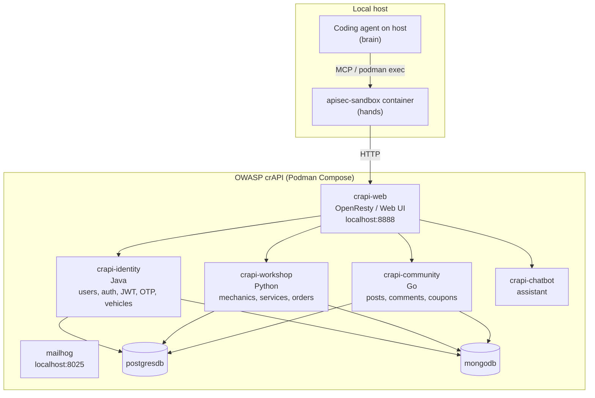

# Coding Agents for Vulnerability Discovery and Exploitation

Proof of concept for letting coding agents (Claude Code, opencode +
DeepSeek-V4-Pro, …) automatically detect candidate API vulnerabilities,
generate executable proof-of-concept exploits, run them against a live
target, and return a structured verdict.

This is a research PoC, not a production scanner. The goal is to show what's
realistic today when you let an agent reason about source **and** execute
HTTP requests end-to-end.

---

## What it does

Given a target source tree and a running instance of the application, the
PoC runs three stages, each as an independent agent invocation:

1. **Survey** — the agent reads the source, identifies stack, routes, auth
   model, trust boundaries, seeded test data, and "suspicious patterns".
   Does **not** name vulnerabilities. Output: `survey.json`.
2. **Hunt** — given the survey, the agent looks for OWASP API Top 10
   vulnerabilities and emits **operational findings**: file/line,
   hypothesis, attack request, setup steps, expected response signal.
   Output: `findings.json`.
3. **Exploit** — for each finding, the agent generates and runs the
   exploit against the live target inside an isolated container, then
   compares the response against the predicted signal. Output:
   `verdicts/<id>.json`, each one `CONFIRMED | FAILED | UNCLEAR`.

`UNCLEAR` matters: a real triage tool needs to admit when it can't prove
something instead of guessing.

## One folder per coding agent, one shared sandbox image

The repo is structured as a small matrix: each coding agent gets its own
folder with the orchestration glue and prompts that fit its native
primitives, and they all share a single Podman image for the actual
exploit-runtime sandbox.

```
.
├── docker/apisec-runner/        # SHARED — sandbox container image + TOOLS.md
│
├── opencode/                    # opencode strategy
│   ├── agents/                  #   custom agents (markdown + YAML frontmatter)
│   ├── mcp/apisec-bridge.py     #   stdio MCP server: JSON-RPC ↔ podman exec
│   ├── opencode.json            #   project-local opencode config (template)
│   ├── run.sh                   #   end-to-end orchestrator
│   └── README.md
│
├── claude/                      # Claude Code strategy
│   ├── agents/                  #   subagents (markdown + YAML frontmatter)
│   ├── mcp/apisec-bridge.py     #   symlink → opencode/mcp/apisec-bridge.py
│   ├── run.sh                   #   end-to-end orchestrator
│   ├── watch.sh                 #   pretty-print live phase logs
│   └── README.md
│
└── findings/                    # outputs (gitignored)
    ├── opencode-runs/<ts>/
    └── claude-runs/<ts>/
```

The `apisec-bridge.py` MCP server and the `apisec-runner` container image
are shared verbatim. Only the agent definitions and the orchestration glue
(`run.sh`) change between strategies.

## Sample run: 10/10 confirmed across all crAPI services

Latest end-to-end run with the opencode strategy (DeepSeek-V4-Pro)
returned **10 CONFIRMED, 0 FAILED, 0 UNCLEAR**, with HTTP evidence
captured per finding. The hunter explored all four crAPI services
(Java/Spring, Python/Django, Go) and produced findings spanning
**6 OWASP API Top 10 categories**.

| ID    | OWASP     | Class                            | File:line                                                 |
|-------|-----------|----------------------------------|-----------------------------------------------------------|
| f-001 | API2:2023 | `alg:none` JWT (PlainJWT fallback) | `services/identity/.../config/JwtProvider.java:197`       |
| f-002 | API2:2023 | RS256↔HS256 algorithm confusion   | `services/identity/.../config/JwtProvider.java:179`       |
| f-003 | API2:2023 | JKU header → SSRF + key injection | `services/identity/.../config/JwtProvider.java:130`       |
| f-004 | API1:2023 | BOLA — vehicle location           | `services/identity/.../controller/VehicleController.java:121` |
| f-005 | API5:2023 | BFLA — admin video delete         | `services/identity/.../controller/ProfileController.java:129` |
| f-006 | API7:2023 | SSRF + token exfiltration         | `services/workshop/crapi/merchant/views.py:87`            |
| f-007 | API8:2023 | SQL injection in apply_coupon     | `services/workshop/crapi/shop/views.py:388`               |
| f-008 | API8:2023 | NoSQL injection (`$regex`)        | `services/community/api/controllers/coupon_controller.go:74` |
| f-009 | API8:2023 | Path traversal (double-encoding)  | `services/workshop/crapi/mechanic/views.py:395`           |
| f-010 | API2:2023 | Cross-service `alg:none` trust    | `services/workshop/utils/jwt.py:61`                       |

Total cost ~$0.066 with prompt caching. Per-finding evidence (request log,
response excerpts, source references) is in
`findings/opencode-runs/<timestamp>/verdicts/*.json`.

---

## The shared sandbox: `apisec-runner`

Both strategies route every shell call into the same container. Treat it as
the agent's "hands": a writable scratch space + a fixed toolkit + read-only
access to the source. The agent's "brain" (the LLM) stays on the host;
only its commands run inside.

### What's in the image

`docker/apisec-runner/Dockerfile` builds on Debian 12 slim and pre-installs:

| Category   | Tools                                                           |
|------------|-----------------------------------------------------------------|
| HTTP       | `curl`, `httpie` (`http`/`https`), `wget`, python `httpx`/`requests`/`aiohttp`, node `fetch` |
| JWT/crypto | `openssl`, `jwt` (jwt-cli), `jwt_tool` (ticarpi), `pyjwt[crypto]`, `python-jose`, `cryptography` |
| JSON/parse | `jq`, `yq`, `xmlstarlet`, `base64`, `xxd`                        |
| Recon      | `ffuf`, `gobuster`, `kr` (kiterunner), `arjun`                   |
| SQL        | `sqlmap`                                                         |
| DB clients | `psql`, `mysql`, `redis-tools`                                   |
| Network    | `dig`, `nslookup`, `nc`, `socat`, `ping`                         |
| General    | `git`, `unzip`, `tar`, `tree`, `vim-tiny`                        |
| Languages  | `python3` (with httpx/pyjwt/cryptography preloaded), `node 18+`  |
| Wordlists  | SecLists subset at `/usr/share/wordlists/{api-objects,api-actions,common,raft-small-words}.txt` |

Plus `docker/apisec-runner/TOOLS.md` — a markdown manifest with **recipes
per attack class** (alg:none forge, RS↔HS confusion, JKU injection, BOLA
enumeration, sqlmap, ffuf, etc.). The agent reads it once at the start of a
session to load the cookbook into context.

### How the container is run

`run.sh` (in each strategy folder) does:

```
podman run -d \
    --name apisec-sandbox \
    --network host \
    --tmpfs /sandbox:rw,size=200m,mode=1777 \
    --read-only --read-only-tmpfs \
    --volume "$WORKSPACE_DIR:/workspace:ro" \
    --env TARGET_URL=$TARGET_URL \
    --env ORACLES_URL_EMAIL=... \
    --env WORKSPACE=/workspace \
    --env SCRATCH=/sandbox \
    apisec-runner sleep infinity
```

Properties this gives the agent:
- `/workspace` is the project source, **read-only**.
- `/sandbox` is the only writable surface, a 200 MB tmpfs that's gone the
  moment the container exits.
- `--read-only` rootfs prevents the agent from `pip install`ing new tools
  or modifying anything outside `/sandbox`.
- `--network host` keeps `localhost:<port>` reachable so the agent can hit
  the target without dealing with Podman host-gateway aliases.
  (Trade-off: the container shares the host's network namespace; this is
  acceptable for an authorized PoC against a local target. For a stricter
  setup, use a dedicated Podman network and bind the target there.)

### Extending the toolkit

Three knobs:

1. **Add a new tool to the image.** Edit `docker/apisec-runner/Dockerfile`
   and add an `apt-get install` / `pip3 install` / direct binary download
   line. Re-build: `podman build -t localhost/apisec-runner:latest
   docker/apisec-runner/`. `run.sh --skip-build` reuses the cached image.

2. **Tell the agent the new tool exists.** Add a recipe section to
   `docker/apisec-runner/TOOLS.md` (`### Tool name — quick recipe`). The
   agent reads this file at the start of each session, so an addition
   propagates automatically — no prompt change needed.

3. **Optional: expose a new MCP tool.** If the new capability shouldn't be
   one shell command but its own first-class tool (e.g. a structured
   "fetch-jwks" helper), add it to `opencode/mcp/apisec-bridge.py` next
   to `bash` in the `TOOLS = [...]` list. The exact wire format is
   documented in the bridge file.

The image is intentionally portable across strategies: nothing in the
Dockerfile or `TOOLS.md` references opencode or Claude Code specifically.

---

## Strategy 1: opencode

`opencode/README.md` has the full quickstart. Here's the architectural
view:

```
                 ┌─────────────────────────────────────┐
                 │  opencode serve  (host, port 4096)  │
                 └─────────────┬───────────────────────┘
                               │ opencode run --attach :4096 --agent X
                               ▼
   surveyor ──▶  Read / Grep / Glob (native)             ──▶  survey.json
                 bash, edit, write, MCP   — DENIED

   hunter   ──▶  Read / Grep / Glob (native)             ──▶  findings.json
                 apisec-sandbox_bash (MCP) — ALLOWED
                 native bash             — DENIED

   exploiter ─▶  Read / Grep / Glob (native)             ──▶  verdicts/<id>.json
                 apisec-sandbox_bash (MCP) — ALLOWED      (one per finding)
                 native bash             — DENIED
                                │ apisec-sandbox_bash
                                ▼
                  ┌──────────────────────────────────┐
                  │  MCP bridge (stdio JSON-RPC)     │
                  │  python3 apisec-bridge.py        │
                  └──────────────┬───────────────────┘
                                 │ podman exec apisec-sandbox bash -lc ...
                                 ▼
                  ┌──────────────────────────────────┐
                  │  apisec-sandbox container        │
                  └──────────────────────────────────┘
```

Key opencode primitives used:

- **Custom agents in `.opencode/agents/<name>.md`** — YAML frontmatter
  declares `mode`, `description`, and a `permission` map that gates
  every tool. The agent's body is its system prompt. opencode reads
  these from `<workspace>/.opencode/agents/`; `run.sh` installs them as
  per-file symlinks at start and cleans up on exit.
- **MCP via `opencode.json`** — registered with `type: local` and an
  absolute path to the bridge script. The agent sees the MCP's `bash`
  tool as `apisec-sandbox_bash` (server-name prefix).
- **Persistent server + `opencode run --attach`** — one `opencode serve`
  is shared across all phases, so the prompt cache (the survey, the
  source pack) hits across hunter and per-finding exploiter calls.
- **Streaming JSON-line output** — `opencode run --format json` emits
  `step_start`, `tool_use`, `text`, `step_finish` events; `run.sh`
  reconstructs the final response by concatenating the `text` events.

## Strategy 2: Claude Code

`claude/README.md` has the full quickstart. Architectural view:

```
   per phase: claude -p --agent <name> --mcp-config <run>/mcp.json --strict-mcp-config
                               │
                               ▼
   surveyor ──▶  Read / Grep / Glob / LS                  ──▶  survey.json
                 (no Bash, no Edit, no Write, no WebFetch)

   hunter   ──▶  Read / Grep / Glob / LS                  ──▶  findings.json
                 mcp__apisec_sandbox__bash  — ALLOWED
                 (no native Bash)

   exploiter ─▶  Read / Grep / Glob                       ──▶  verdicts/<id>.json
                 mcp__apisec_sandbox__bash  — ALLOWED
                                │
                                ▼
                  ┌──────────────────────────────────┐
                  │  MCP bridge (stdio JSON-RPC)     │
                  │  python3 apisec-bridge.py        │
                  └──────────────┬───────────────────┘
                                 │ podman exec apisec-sandbox bash -lc ...
                                 ▼
                  ┌──────────────────────────────────┐
                  │  apisec-sandbox container        │
                  └──────────────────────────────────┘
```

Key Claude Code primitives used:

- **Subagents in `.claude/agents/<name>.md`** — YAML frontmatter declares
  `name`, `description`, and a `tools` whitelist. Anything not in the
  whitelist is unavailable to the agent: omitting `Bash` is enough to
  remove host shell access. The body of the markdown file is the
  system prompt. `run.sh` installs them as per-file symlinks under
  `<workspace>/.claude/agents/`.
- **MCP via `--mcp-config <file> --strict-mcp-config`** — `run.sh`
  generates a per-run `mcp.json` with an absolute path to the bridge
  and passes it to Claude. `--strict-mcp-config` ensures only this MCP
  is loaded (no globals leak in). The MCP's `bash` tool is exposed to
  agents as `mcp__apisec_sandbox__bash`.
- **Per-call invocation** — each phase is a separate `claude -p
  --agent <name>` process. No persistent server; per-call cold-start
  is the trade-off for simpler orchestration.
- **Streaming via `--output-format stream-json`** — emits `system`,
  `assistant`, `user` (tool_results), and `result` events. `run.sh`
  reconstructs the final response by concatenating every `text` block
  inside `assistant` events. `claude/watch.sh` pretty-prints the same
  stream live in another terminal.

## Side-by-side comparison

|                            | opencode                                    | Claude Code                                    |
|----------------------------|---------------------------------------------|------------------------------------------------|
| Agent definition           | `.opencode/agents/<name>.md`                | `.claude/agents/<name>.md`                     |
| Tool gating                | `permission` map in frontmatter             | `tools` whitelist in frontmatter               |
| MCP tool name              | `apisec-sandbox_bash`                       | `mcp__apisec_sandbox__bash`                    |
| MCP registration           | `opencode.json` `mcp` block                 | `--mcp-config <file> --strict-mcp-config`      |
| Server lifetime            | `opencode serve` shared across phases       | one process per phase                          |
| Stream format              | flat (`type: text \| tool_use \| step_finish`)   | wrapped (`assistant.message.content[].type`)   |
| Per-call cost              | warm cache after phase 1                    | full cold-start each call                      |
| Skip permission prompts    | `--dangerously-skip-permissions`            | `--dangerously-skip-permissions`               |

---

## Adding a new coding agent strategy

The contract every strategy must honor:

1. Live in its own top-level folder `<agent>/`.
2. Reuse `docker/apisec-runner/` as-is (mount source RO at `/workspace`,
   tmpfs at `/sandbox`).
3. Reuse `opencode/mcp/apisec-bridge.py` as the MCP backend (link or
   copy). The bridge is stdlib-Python only; no dependencies.
4. Provide an executable `run.sh` with at minimum these flags:
   `--target-url`, `--workspace`, `--model`, `--findings <path>` (skip
   survey + hunter), `--skip-build`, `--keep-container`.
5. Produce these outputs under `findings/<agent>-runs/<timestamp>/`:
   `survey.json`, `findings.json`, `verdicts/<id>.json`, plus the raw
   per-phase `*.jsonl` streams for debugging.
6. Translate the **same** three system prompts (the body of
   `opencode/agents/{surveyor,hunter,exploiter}.md`) into whatever
   format the new agent expects (a JSON object, a markdown frontmatter,
   a CLI flag, …).

Suggested skeleton when adding a new one:

```
<agent>/
├── agents/                 # or wherever the agent's prompt lives
│   ├── surveyor.md
│   ├── hunter.md
│   └── exploiter.md
├── mcp/
│   └── apisec-bridge.py    # symlink → ../../opencode/mcp/apisec-bridge.py
├── run.sh
├── watch.sh                # optional but recommended
└── README.md               # how the strategy maps to the agent's primitives
```

Things that will probably differ between strategies:

- **MCP registration**. Some agents use a config file, others a CLI flag.
- **Tool naming convention**. opencode uses `<server>_<tool>`,
  Claude uses `mcp__<server>__<tool>`. Double-check on first run.
- **Tool gating**. opencode uses a `permission` map, Claude uses a `tools`
  whitelist, others may use roles. The agent's frontmatter is the natural
  home if available; otherwise fall back to CLI flags.
- **Stream format**. Each agent emits a different JSON shape; `run.sh`'s
  parser block has to match.

---

## Requirements

- `podman` (rootless works) + `podman build` / `podman run`
- `python3` (used by the MCP bridge and orchestrator helpers — only
  stdlib, no virtualenv needed)
- The CLI for the strategy you want to use:
  - `opencode` ≥ 1.14.31 for the opencode strategy.
  - `claude` (Claude Code CLI) for the claude strategy.

## Live setup (target)

The default target wired into the prompts is OWASP crAPI, an intentionally
vulnerable Java/Spring app with deliberate OWASP API Top 10 issues. Other
intentionally-vulnerable apps (WebGoat, VAmPI, Juice Shop, DVWS) work too
— at most you'd tweak the `--scope` hint passed to the surveyor.

```bash
git clone https://github.com/OWASP/crAPI.git
cd crAPI/deploy/docker
podman compose -f docker-compose.yml up -d
curl -i http://localhost:8888       # expect HTTP 200
```

## Quickstart

### opencode + DeepSeek-V4-Pro

DeepSeek-V4-Pro is interesting because it's cheap (~$0.01 per finding) and
supports tool calling reliably through opencode. Configure the provider
once in `~/.config/opencode/opencode.json`:

```json
{
  "$schema": "https://opencode.ai/config.json",
  "permission": {
    "bash": "allow",
    "external_directory": "allow",
    "webfetch": "allow"
  },
  "provider": {
    "deepseek": {
      "npm": "@ai-sdk/openai-compatible",
      "name": "DeepSeek",
      "options": {
        "baseURL": "https://api.deepseek.com",
        "apiKey": "sk-..."
      },
      "models": {
        "deepseek-v4-pro": {
          "name": "DeepSeek-V4-Pro",
          "limit": { "context": 1048576, "output": 262144 }
        }
      }
    }
  }
}
```

Then:

```bash
opencode/run.sh \
    --target-url http://localhost:8888 \
    --workspace ./crAPI \
    --model deepseek/deepseek-v4-pro
```

### Claude Code

```bash
claude/run.sh \
    --target-url http://localhost:8888 \
    --workspace ./crAPI \
    --model claude-sonnet-4-6
```

### Skip survey + hunter, only verify

Both strategies accept `--findings <path-to-findings.json>`. Useful when
iterating on the exploiter, or running the same findings against a target
that's been re-deployed.

```bash
opencode/run.sh ... \
    --findings findings/opencode-runs/20260503-063112/findings.json
```

### Watching live progress

`claude/watch.sh` pretty-prints the live stream-json events from any phase:

```bash
claude/watch.sh                   # auto-detect the active phase
claude/watch.sh hunter            # specific phase
claude/watch.sh --run 20260503-072300   # past run
```

For opencode, attach the TUI to the running serve:

```bash
opencode attach http://localhost:4096 --dir ./crAPI
```

---

## Outputs

Every run writes to `findings/<agent>-runs/<timestamp>/`:

```
survey.json           # surveyor output
findings.json         # hunter output
verdicts/<id>.json    # one per finding from the exploiter
reports/<id>.md       # markdown attack-chain report per finding (auto-generated)
exploiter-<id>.jsonl  # per-finding raw stream events
*.jsonl               # phase streams (surveyor, hunter, exploiter master)
```

The reports under `reports/` are produced after the verify loop ends by
`lib/build-report.py`, which auto-detects the stream format (opencode flat
events vs. Claude wrapped events) and renders a phase-by-phase narrative
with the bash commands, tool results, and final verdict — JWTs redacted.

The verdict schema is:

```
{
  "status": "CONFIRMED | FAILED | UNCLEAR",
  "evidence": "concise narrative of HTTP evidence",
  "requests": [
    {"method": "POST", "url": "...", "status": 200, "body_excerpt": "..."}
  ],
  "reason": "why this verdict follows from the evidence"
}
```

## Operational fields on every finding

The hunter does not just emit "there's a BOLA in foo.java". Each finding
carries enough detail for an automated exploit generator to act on:

- `victim_identity` — who the exploit targets / impersonates.
- `attack_request` — method, path, headers, body, notes.
- `expected_response_signal` — concrete substring/field that proves the
  bug fired.
- `setup_state` — steps the PoC runs before the attack (signup, login).
- `target_state_required` — preexisting target state the PoC cannot
  create itself (seed users, fixed UUIDs); `null` means self-sufficient.

These are authoritative for the exploiter — it builds the exploit directly
from them rather than improvise.

## Example target: crAPI architecture (reference)



## Troubleshooting

### `podman build` fails

The Dockerfile downloads single-file binaries (jwt-cli, ffuf, gobuster,
kr) from GitHub releases. If your network is constrained, those URLs are
the points of failure — you'll see a `curl` non-zero exit. Either retry
or pin to a mirror.

### Container can't reach the target

`run.sh` uses `--network=host`. If your target is bound to a different
interface than `localhost:<port>`, pass `--target-url http://<that>:<port>`.

### MCP tool not found

Most likely the bridge failed to start.
- opencode: `cd <workspace> && opencode mcp list` shows the status.
- Claude: `cat findings/claude-runs/<ts>/*.err` has Claude's MCP startup
  errors.
- Run the bridge manually: `python3 opencode/mcp/apisec-bridge.py` —
  it should sit waiting for stdin (Ctrl-C to exit).

### Agent calls native bash anyway

Check the agent's frontmatter:
- opencode: `permission.bash: deny`.
- Claude: don't list `Bash` in `tools`.

### "agent not found"

The agent files are installed under `<workspace>/.opencode/agents/` or
`<workspace>/.claude/agents/` at run start. If `run.sh` crashed early
they may be missing — re-run, the cleanup trap is idempotent. opencode
specifically does **not** follow directory symlinks for project-config
discovery; we use per-file symlinks for that reason.

### Tail of the run says all verdicts are MALFORMED

The exploiter runs but produced 0-byte verdicts. Most often this is a
stream-parser mismatch (the agent emitted a different JSON shape than
the parser expects). The full stream is preserved in the run's
`exploiter.jsonl`, and `findings/<agent>-runs/<ts>/exploiter.jsonl` can
be re-parsed offline to recover verdicts.
