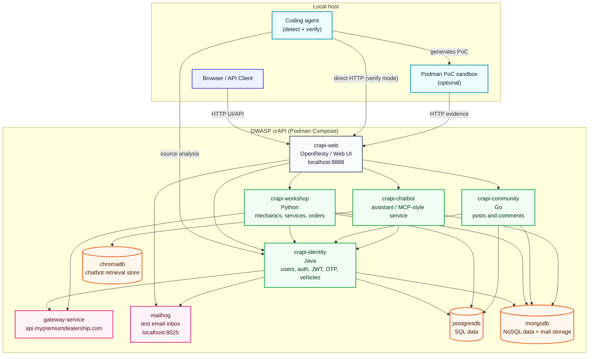

# Coding Agents for Vulnerability Discovery and Exploitation

Proof of concept for using coding agents (Claude Code, OpenAI Codex, opencode +
DeepSeek-V4-Pro) to automatically detect candidate API vulnerabilities,
generate executable proof-of-concept exploits, run them against a live target,
and return a structured verdict.

This is a research PoC, not a production scanner. The goal is to show what's
realistic today when you let an agent both reason about source and execute
HTTP requests end-to-end.

## What it does

Given a target source tree and a running instance of the application, the PoC
runs three stages:

1. **Detect** — the agent reads the source, identifies candidate vulnerabilities
   (OWASP API Top 10 by default), and emits operational findings: file/line,
   hypothesis, attack request, setup steps, expected response signal.
2. **Verify** — for each finding, the agent generates and runs an exploit
   against the live target. Two execution paths are supported:
   - PoC-in-sandbox: the agent emits Python code, the demo runs it inside an
     isolated Podman container with a fixed `TARGET_URL`.
   - Direct execution: the agent itself drives `curl`/HTTP via its `Bash` tool
     against the target (no sandbox, no Python layer).
3. **Verdict** — each finding ends as `CONFIRMED`, `FAILED`, or `UNCLEAR` with
   captured HTTP evidence (requests, responses, status codes).

`UNCLEAR` matters: a real triage tool needs to admit when it can't prove
something instead of guessing.

## Supported coding agents

Selectable via `--llm {claude,codex,opencode}`.

- **Claude Code** (`claude` CLI) — default. Recommended models:
  `claude-opus-4-7` for detection, `claude-sonnet-4-6` for PoC generation.
- **OpenAI Codex** (`codex` CLI) — works with GPT-class models.
- **opencode** — runs DeepSeek-V4-Pro (and other providers) through the
  Vercel AI SDK. Two execution modes:
  - CLI per call: `opencode run` invoked once per detect/verify.
  - Persistent server (`--use-api`): one `opencode serve` shared across calls
    via `opencode run --attach`. Faster when there are many findings.

DeepSeek-V4-Pro is interesting because it's cheap (~$0.01 per finding verified
end-to-end) and supports tool calling reliably through opencode, so it can
drive `Bash`/`Read`/`Grep`/`Glob` directly during verification.

Custom invocations are supported via env vars: `CLAUDE_COMMAND`,
`CLAUDE_EXEC_FLAGS`, `CODEX_COMMAND`, `CODEX_EXEC_FLAGS`, `OPENCODE_COMMAND`,
`OPENCODE_EXEC_FLAGS`.

## Example target: OWASP crAPI

The default target wired into the prompts is OWASP crAPI ("completely
ridiculous API"), an intentionally vulnerable Java/Spring Boot training app
with deliberate OWASP API Top 10 issues. Any other intentionally-vulnerable
app with a similar source layout (WebGoat, VAmPI, Juice Shop, DVWS) can be
swapped in by editing the prompts in `01_detect.py` and `02_verify.py`.

### crAPI architecture



For a fast walk-through, scope can be bounded to a single service like
`services/identity` (authentication, authorization, JWT/OTP, account,
vehicle code paths). The opencode strategy below scans the entire repo by
default — see the sample run for a full-tree result that covers all four
services.

## Sample run: 10/10 confirmed across all crAPI services

Latest end-to-end run with the opencode strategy (DeepSeek-V4-Pro, three
agents — surveyor, hunter, exploiter — with all execution routed through
the `apisec-sandbox` container) returned **10 CONFIRMED, 0 FAILED, 0
UNCLEAR**, with HTTP evidence captured per finding. The hunter explored all
four crAPI services in three different languages — `services/identity`
(Java/Spring), `services/workshop` (Python/Django), `services/community`
(Go) — and produced findings spanning **6 OWASP API Top 10 categories**.

| ID    | OWASP     | Class                            | File:line                                                 |
|-------|-----------|----------------------------------|-----------------------------------------------------------|
| f-001 | API2:2023 | `alg:none` JWT (PlainJWT fallback) | `services/identity/.../config/JwtProvider.java:197`       |
| f-002 | API2:2023 | RS256↔HS256 algorithm confusion   | `services/identity/.../config/JwtProvider.java:179`       |
| f-003 | API2:2023 | JKU header → SSRF + key injection | `services/identity/.../config/JwtProvider.java:130`       |
| f-004 | API1:2023 | BOLA — vehicle location           | `services/identity/.../controller/VehicleController.java:121` |
| f-005 | API5:2023 | BFLA — admin video delete         | `services/identity/.../controller/ProfileController.java:129` |
| f-006 | API7:2023 | SSRF + token exfiltration         | `services/workshop/crapi/merchant/views.py:87`            |
| f-007 | API8:2023 | SQL injection in apply_coupon     | `services/workshop/crapi/shop/views.py:388`               |
| f-008 | API8:2023 | NoSQL injection (`$regex`)        | `services/community/api/controllers/coupon_controller.go:74` |
| f-009 | API8:2023 | Path traversal (double-encoding)  | `services/workshop/crapi/mechanic/views.py:395`           |
| f-010 | API2:2023 | Cross-service `alg:none` trust    | `services/workshop/utils/jwt.py:61`                       |

### f-001 — `alg:none` JWT acceptance

`JwtProvider.validateJwtToken` parses tokens via `SignedJWT.parse`. When that
throws `ParseException`, the catch block falls back to `PlainJWT.parse` and
returns `true` — unsigned tokens are accepted as valid. A forged
`alg:none` JWT with `sub=admin@example.com` returned admin's seeded vehicle
data (VIN `6NBBY70FWUM324316`, Audi RS7) on
`GET /identity/api/v2/vehicle/vehicles`; the same endpoint without a token
returns 401.

### f-002 / f-003 — JWT key trust bugs

`JwtProvider` accepts a `jku` (JWK Set URL) claim in the JWT header for
non-HS256 algorithms and unconditionally fetches that URL to load a JWKS
into the trust set. The exploiter agent stood up an HTTP server inside the
sandbox, served its own JWKS, and forged an RS256 token signed with its
private key — `pointing the server at its own attacker JWKS`. The forged
admin token was accepted on the same vehicle endpoint, returning admin's
PII. (HS256 confusion via the base64-DER public key was attempted; the
deployed Nimbus JWT version rejected it. The JKU path was the working
exploit.)

### f-004 — BOLA on vehicle location

`GET /identity/api/v2/vehicle/{carId}/location` looks up the vehicle by UUID
and returns owner `fullName`, `email`, and GPS coordinates without comparing
the requesting user's identity to `vehicle.getOwner()`. A `test@example.com`
user retrieved Adam's vehicle location:

```
HTTP 200
{ "carId": "f89b5f21-7829-45cb-a650-299a61090378",
  "fullName": "Adam",
  "email": "adam007@example.com",
  "vehicleLocation": { "latitude": "32.778889", "longitude": "-91.919243" } }
```

### f-005 — BFLA: admin video delete

A regular signed-up user uploaded a video at `POST /identity/api/v2/user/videos`
(id=53). Hitting `DELETE /identity/api/v2/user/videos/53` with a non-admin
token returns 403 — but the response message helpfully points at the admin
endpoint. Hitting `DELETE /identity/api/v2/admin/videos/53` with the *same*
non-admin token returned 200 with `"User video deleted successfully"`. The
admin path was missing its role check.

### f-006 — SSRF + bearer-token exfiltration

`workshop.merchant.ContactMechanicView.post` accepts a `mechanic_api` URL
from the request body and forwards the call (including the caller's
`Authorization` header) to that URL. The exploiter started a logging HTTP
server inside the sandbox, sent the request with `mechanic_api` pointing at
it, and observed both the synthetic `{"success":true}` reply mirrored by the
API and the victim's bearer token captured in the listener log.

### f-007 — SQL injection via coupon code

`ApplyCouponView` builds a raw SQL string by concatenating the
user-controlled `coupon_code` field. `coupon_code = "' UNION SELECT email
FROM user_login WHERE '1'='1"` returned 400 with the leaked email
concatenated into the response message — confirming arbitrary SQL execution
against the `user_login` table.

### f-008 — NoSQL injection in coupon validation

`coupon_controller.ValidateCoupon` (Go service) passes the request JSON
straight into a MongoDB `FindOne`. A payload of
`{"coupon_code": {"$regex": ".*"}}` returned a real coupon
(`TRAC075`, amount 75) — proving the Go handler does not flatten or
validate operator-shaped values.

### f-009 — Path traversal via double URL-encoding

`mechanic.download_report` validates the `filename` query param with a regex
that permits `%HH` sequences, then passes the result through `unquote()`
**after** validation. A double-encoded payload (`%252e%252e%252f...`) passes
the regex, the `unquote()` decodes it to `../../../etc/passwd`, and
`os.path.abspath` resolves outside the report directory. The endpoint
returned `/etc/passwd` (`root:x:0:0:root:/root:/bin/sh\n...`).

### f-010 — Cross-service `alg:none` trust

`workshop.utils.jwt` decodes incoming tokens with
`jwt.decode(..., options={"verify_signature": False})` and trusts the `sub`
claim. Combined with f-001 (identity service `/verify` accepts `alg:none`),
a forged `alg:none` token for `adam007@example.com` returned that user's
order history at `GET /workshop/api/shop/orders/all`. Demonstrates how a
single auth bug (f-001) compounds into a cross-service identity-spoofing
primitive.

Per-finding evidence (request log, response excerpts, source references) is
in `findings/opencode-runs/<timestamp>/verdicts/*.json`.

## Strategies — one folder per coding agent

The repo holds one strategy per coding agent. Each one adapts to its tool's
native primitives: opencode has agents + MCP, Claude Code has subagents +
the agents API, Codex has its own runtime. The shared piece across all
three is the `apisec-runner` sandbox container — same toolkit, different
front ends.

```
.
├── docker/apisec-runner/      # SHARED — the sandbox container image
│   ├── Dockerfile             # Debian slim + curl/httpie/jwt_tool/sqlmap/ffuf/...
│   └── TOOLS.md               # manifest + recipes the agent reads at runtime
│
├── opencode/                  # opencode strategy — IMPLEMENTED
│   ├── agents/{surveyor,hunter,exploiter}.md
│   ├── mcp/apisec-bridge.py
│   ├── opencode.json
│   ├── run.sh
│   └── README.md
│
├── claude/                    # Claude Code strategy — PLANNED
└── codex/                     # Codex strategy — PLANNED
```

### How the opencode strategy works

A three-stage pipeline of native opencode agents, each declared as a
markdown file with YAML frontmatter that constrains its tool access. All
shell execution is routed through an MCP server that proxies into a
read-only-filesystem Podman container.

```
                 ┌─────────────────────────────────────┐
                 │  opencode serve  (host, port 4097)  │
                 └─────────────┬───────────────────────┘
                               │ opencode run --attach :4097 --agent X
                               ▼
                 ┌──────────────────────────────────────────┐
   surveyor ──▶  │  read / grep / glob          (native)    │ ──▶  survey.json
   (no exec)     │  bash / edit / write       — DENIED      │
                 └──────────────────────────────────────────┘
                               │
                               ▼
                 ┌──────────────────────────────────────────┐
   hunter   ──▶  │  read / grep / glob          (native)    │ ──▶  findings.json
   (live probe)  │  apisec-sandbox_bash         (MCP)       │      [N findings]
                 │  bash                       — DENIED     │
                 └──────────────┬───────────────────────────┘
                                │ apisec-sandbox_bash
                                ▼
                  ┌──────────────────────────────────────┐
                  │  MCP bridge (stdio)                  │
                  │  python3 opencode/mcp/apisec-bridge  │
                  └──────────────┬───────────────────────┘
                                 │ podman exec apisec-sandbox bash -lc ...
                                 ▼
                  ┌──────────────────────────────────────┐
                  │  apisec-sandbox container            │
                  │  toolkit + /workspace (RO source)    │
                  │  /sandbox (RW tmpfs) + TOOLS.md      │
                  │  network: --network=host             │
                  └──────────────┬───────────────────────┘
                                 │ HTTP
                                 ▼
                  ┌──────────────────────────────────────┐
                  │  Target API (e.g. crAPI :8888)       │
                  └──────────────────────────────────────┘
                               │
   exploiter ─▶  per-finding loop ─▶ verdicts/<id>.json (CONFIRMED|FAILED|UNCLEAR)
```

What each piece is doing:

- **Custom agents (`opencode/agents/*.md`)** — opencode reads these from
  `<workspace>/.opencode/agents/` (we install per-file symlinks at run
  time). Each agent's YAML frontmatter sets `permission` rules that
  whitelist exactly the tools it needs and deny the rest. The hunter and
  exploiter both have `bash: deny` (no host shell) and
  `apisec-sandbox_bash: allow` (only the sandboxed shell). The native
  `read`/`grep`/`glob` are kept for static analysis on the read-only
  source tree.

- **MCP server (`opencode/mcp/apisec-bridge.py`)** — a small stdio
  JSON-RPC bridge (~200 lines, stdlib only). opencode spawns it on
  startup and discovers its `bash` tool. Each `tools/call` becomes
  `podman exec apisec-sandbox bash -lc "<cmd>"` against the running
  container; output (truncated to 64 KB) returns as the tool result.

- **Sandbox container (`docker/apisec-runner/`)** — a Debian-slim image
  with the API hacking toolkit (curl, httpie, jwt_tool, jwt-cli, sqlmap,
  ffuf, gobuster, kr, arjun, python httpx/pyjwt/cryptography, jq, db
  clients, SecLists wordlists). The project source is mounted read-only
  at `/workspace`. `/sandbox` is a writable tmpfs (200 MB) for exploit
  scripts and attacker-controlled servers. The container reads
  `/sandbox/TOOLS.md` on first call to learn its environment and recipes.

- **Cross-finding context** — running each agent through one shared
  `opencode serve` lets the prompt-cache hit rate stay high (the survey
  is 30k+ tokens of source context that gets reused across hunter calls
  and across all per-finding exploiter calls). A 10-finding run lands
  around `$0.05–$0.15` total with DeepSeek-V4-Pro.

- **Why a sandbox at all** — the agent freely runs `curl`, custom Python
  scripts, attacker-controlled HTTP listeners on tmpfs ports, etc. Doing
  that against a target on the host means the agent's "hands" need to
  be somewhere we can throw away — read-only filesystem + tmpfs scratch
  + a fixed toolkit. The container is destroyed at the end of every run.

### Claude Code and Codex strategies (planned)

The two upcoming folders will keep the same external contract — a single
`run.sh` that produces a `survey.json`, `findings.json`, and one
`verdicts/<id>.json` per finding — but use each tool's native primitives:

- **`claude/`** — Claude Code subagents (`.claude/agents/*.md`) for
  surveyor / hunter / exploiter, with the same MCP `apisec-bridge`
  re-exposed via Claude Code's MCP support. The Claude Code Agents API
  may also be a fit for orchestration.

- **`codex/`** — Codex's tool definitions and built-in container/sandbox
  flags. Codex already has a `--dangerously-bypass-approvals-and-sandbox`
  mode and tool-spec config; we wire those instead of writing a new MCP.

In all three cases the `docker/apisec-runner/` image and `TOOLS.md`
manifest are shared. Only the agent definitions and the orchestration
glue change.

## Repository layout

```text
.
├── docker/
│   ├── apisec-runner/         # NEW — sandbox image + TOOLS.md (used by opencode)
│   └── poc-runner/            # legacy — Python PoC sandbox used by scripts/02_verify.py
├── opencode/                  # opencode strategy (see opencode/README.md)
├── findings/                  # candidate JSONs, verified runs, opencode-runs/
├── scripts/                   # legacy Python orchestrator (Claude/Codex/opencode CLI)
│   ├── 01_detect.py
│   ├── 02_verify.py
│   ├── 03_demo.py
│   ├── api.py
│   ├── common.py
│   ├── models.py
│   └── sandbox_mcp.py
├── pyproject.toml
└── uv.lock
```

## Requirements

- Python 3.12, `uv`
- One coding agent CLI on `PATH`:
  - `claude` (Claude Code), or
  - `codex` (OpenAI Codex) + Node.js, or
  - `opencode`
- Podman + `podman compose` or `podman-compose` (only required for the
  sandbox PoC path)

If a CLI lives in a Toolbox container while Podman runs on the base system,
override the launcher with `CLAUDE_COMMAND` / `CODEX_COMMAND` /
`OPENCODE_COMMAND`.

## Install

```bash
uv sync
```

If your environment has a read-only global uv cache:

```bash
UV_CACHE_DIR=/tmp/uv-cache uv sync
```

## Cache mode (no LLM, no target)

Deterministic walk-through of the flow without the LLM, crAPI, network, or
Podman:

```bash
uv run python scripts/03_demo.py --from-cache --no-pause
```

Expected:

```text
Metrics: 2 confirmed, 1 unclear, 0 failed.
```

Drop `--no-pause` to step through each stage.

## Live setup

Clone the target into the repo root:

```bash
git clone https://github.com/OWASP/crAPI.git
```

Start it:

```bash
cd crAPI/deploy/docker
podman compose -f docker-compose.yml up -d
```

Verify:

```bash
curl -i http://localhost:8888
```

(Override the URL with `--target-url` when running against a different
deployment.)

## Build the PoC sandbox image (optional)

Only needed for the sandbox PoC path. Skip for the direct-execution path
used by `--use-api`.

```bash
podman build -t strike-demo/poc-runner:latest docker/poc-runner
```

The image contains Python, `httpx`, `requests`, `curl`, `jq`. PoCs run with
read-only filesystem, memory/PID limits, and `TARGET_URL` injected as env.

## End-to-end with Claude

```bash
uv run python scripts/03_demo.py \
  --service identity \
  --max-findings 3 \
  --target-url http://localhost:8888 \
  --llm claude \
  --model claude-opus-4-7 \
  --detect-timeout 1800 \
  --codex-timeout 1800 \
  --runtime podman \
  --no-pause
```

## End-to-end with DeepSeek via opencode

DeepSeek-V4-Pro through opencode, using the persistent-server path so the
agent can `curl` directly against the target without a Python sandbox in the
middle:

```bash
uv run python scripts/03_demo.py \
  --llm opencode --use-api \
  --model deepseek/deepseek-v4-pro \
  --candidates findings/candidates-f002-f003.json \
  --no-pause
```

The opencode provider config (in `~/.config/opencode/opencode.json`) needs
the DeepSeek provider and the auto-allow permission rules for `bash`,
`external_directory`, `webfetch` so the agent can drive curl without prompts.

```json
{
  "$schema": "https://opencode.ai/config.json",
  "permission": {
    "bash": "allow",
    "external_directory": "allow",
    "webfetch": "allow"
  },
  "provider": {
    "deepseek": {
      "npm": "@ai-sdk/openai-compatible",
      "name": "DeepSeek",
      "options": {
        "baseURL": "https://api.deepseek.com",
        "apiKey": "..."
      },
      "models": {
        "deepseek-v4-pro": {
          "name": "DeepSeek-V4-Pro",
          "limit": { "context": 1048576, "output": 262144 }
        }
      }
    }
  }
}
```

## End-to-end with Codex

```bash
uv run python scripts/03_demo.py \
  --service identity \
  --max-findings 3 \
  --target-url http://localhost:8888 \
  --llm codex \
  --model gpt-5.5 \
  --detect-timeout 1800 \
  --codex-timeout 1800 \
  --runtime podman \
  --no-pause
```

## Seeded candidates (skip detect)

Useful when iterating on the verify path or running a reliable timed walk-through.

```bash
uv run python scripts/03_demo.py \
  --candidates findings/candidates-f002-f003.json \
  --max-findings 2 \
  --target-url http://localhost:8888 \
  --llm opencode --use-api \
  --model deepseek/deepseek-v4-pro \
  --no-pause
```

## Outputs

Every run produces:

- `findings/candidates-<timestamp>.json` — detect output
- `findings/verified-<timestamp>.json` — per-finding verdicts + evidence
- `findings/demo-run-<timestamp>.json` — full reproducible run record
- `findings/runs/run-<timestamp>.json` — partial state, written continuously
  during the run; `tail -f` it from another terminal to follow progress

## Operational fields on every finding

The detect step does not just emit "there's a BOLA in foo.java". Each finding
carries:

- `victim_identity` — who the exploit targets / impersonates.
- `attack_request` — method, path, headers, body, notes.
- `expected_response_signal` — concrete substring/field that proves the bug
  fired.
- `setup_state` — steps the PoC runs before the attack (signup, login).
- `target_state_required` — preexisting target state the PoC cannot create
  itself (seed users, fixed UUIDs); `null` means self-sufficient.

These are authoritative for the verifier — it builds the exploit directly
from them rather than improvise.

## Useful commands

```bash
uv run ruff check .
uv run ruff format .
```

Run the sandbox directly against an existing PoC:

```bash
uv run python scripts/sandbox_mcp.py run poc.py \
  --target-url http://localhost:8888 \
  --runtime podman
```

## Troubleshooting

### `podman` not found / `podman compose` not available

```bash
command -v podman
podman-compose -f docker-compose.yml up -d   # fallback
```

### crAPI is unreachable

```bash
podman ps
curl -i http://localhost:8888
```

### LLM is slow or unavailable

Cache mode:

```bash
uv run python scripts/03_demo.py --from-cache
```

### Claude refuses a specific finding

The verifier catches refusals, marks the finding as `UNCLEAR` with the error
in evidence, and continues. For consistent refusals, rephrase the hypothesis
(avoid "any user including admin" language) or fall back to `--llm codex` /
`--llm opencode`.

### opencode + DeepSeek silently does not run tools

If you see lots of streamed text but no tool calls, two common causes:

1. The DeepSeek model is configured as a reasoning model in opencode config
   (`reasoning: true`, `thinking: { type: "enabled" }`) — reasoning variants
   may not emit tool calls. Try `deepseek-v4-flash` or remove the reasoning
   flags.
2. Permission gates are blocking `bash` / `external_directory`. Add the
   `permission` block shown above to your opencode config.

### Codex stuck on approval prompts

```bash
CODEX_EXEC_FLAGS="--dangerously-bypass-approvals-and-sandbox" uv run python ...
```

Use only against authorized, intentionally-vulnerable local targets.
