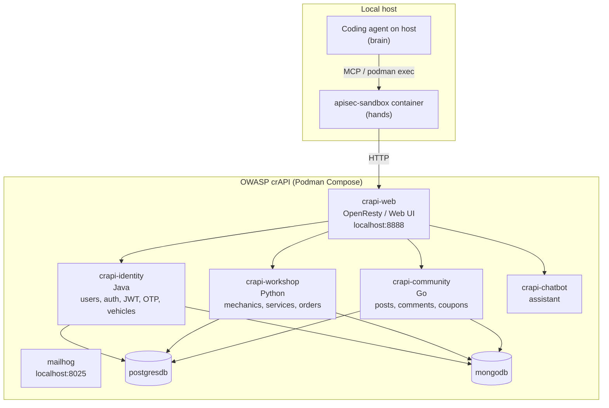

# Outputs & troubleshooting

## Outputs

Every run writes to `findings/<agent>-runs/<timestamp>/`:

```
survey.json           # surveyor output
findings.json         # hunter output
verdicts/<id>.json    # one per finding from the exploiter
reports/<id>.md       # markdown attack-chain report per finding (auto-generated)
exploiter-<id>.jsonl  # per-finding raw stream events
*.jsonl               # phase streams (surveyor, hunter, exploiter master)
```

The reports under `reports/` are produced after the verify loop ends by
`lib/build-report.py`, which auto-detects the stream format (opencode
flat events vs. Claude wrapped events) and renders a phase-by-phase
narrative with the bash commands, tool results, and final verdict —
JWTs and other long opaque tokens redacted.

Real samples are in [`sample-reports/`](sample-reports/) — 13 findings ×
2 strategies = 26 markdown reports from actual runs against crAPI.

## Verdict schema

```
{
  "status": "CONFIRMED | FAILED | UNCLEAR",
  "evidence": "concise narrative of HTTP evidence",
  "requests": [
    {"method": "POST", "url": "...", "status": 200, "body_excerpt": "..."}
  ],
  "reason": "why this verdict follows from the evidence"
}
```

## Operational fields on every finding

The hunter does not just emit "there's a BOLA in foo.java". Each finding
carries enough detail for an automated exploit generator to act on:

- `victim_identity` — who the exploit targets / impersonates.
- `attack_request` — method, path, headers, body, notes.
- `expected_response_signal` — concrete substring/field that proves the
  bug fired.
- `setup_state` — steps the PoC runs before the attack (signup, login).
- `target_state_required` — preexisting target state the PoC cannot
  create itself (seed users, fixed UUIDs); `null` means self-sufficient.

These are authoritative for the exploiter — it builds the exploit
directly from them rather than improvising.

## Example target: crAPI architecture (reference)



## Troubleshooting

### `podman build` fails

The Dockerfile downloads single-file binaries (jwt-cli, ffuf, gobuster,
kr) from GitHub releases. If your network is constrained, those URLs
are the points of failure — you'll see a `curl` non-zero exit. Either
retry or pin to a mirror.

### Container can't reach the target

`run.sh` uses `--network=host`. If your target is bound to a different
interface than `localhost:<port>`, pass `--target-url http://<that>:<port>`.

### MCP tool not found

Most likely the bridge failed to start.

- opencode: `cd <workspace> && opencode mcp list` shows the status.
- Claude: `cat findings/claude-runs/<ts>/*.err` has Claude's MCP startup
  errors.
- Run the bridge manually: `python3 opencode/mcp/apisec-bridge.py` — it
  should sit waiting for stdin (Ctrl-C to exit).

### Agent calls native bash anyway

Check the agent's frontmatter:

- opencode: `permission.bash: deny`.
- Claude: don't list `Bash` in `tools`.

### "agent not found"

The agent files are installed under `<workspace>/.opencode/agents/` or
`<workspace>/.claude/agents/` at run start. If `run.sh` crashed early
they may be missing — re-run, the cleanup trap is idempotent. opencode
specifically does **not** follow directory symlinks for project-config
discovery; we use per-file symlinks for that reason.

### Tail of the run says all verdicts are MALFORMED

The exploiter ran but produced 0-byte verdicts. Most often this is a
stream-parser mismatch (the agent emitted a different JSON shape than
the parser expects). The full stream is preserved in the run's
`exploiter.jsonl`, and `findings/<agent>-runs/<ts>/exploiter.jsonl` can
be re-parsed offline to recover verdicts.
